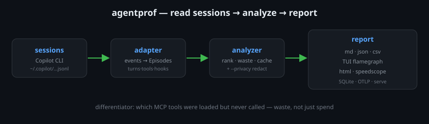
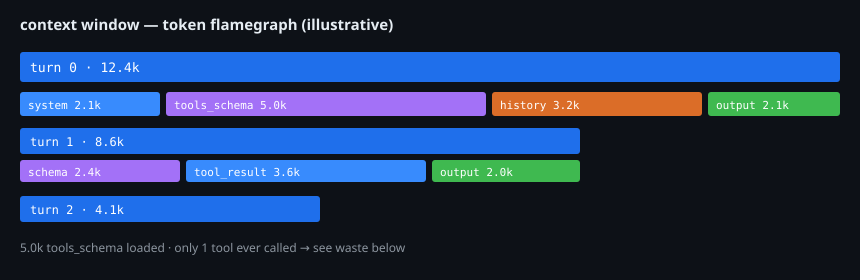
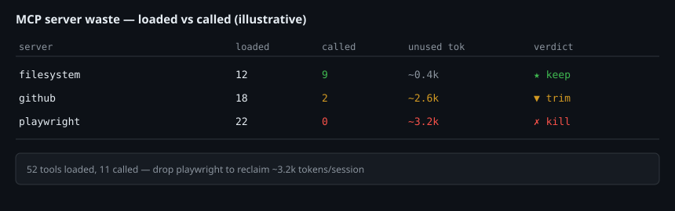

# agentprof

> Perf flamegraph + ROI profiler for AI coding agents. Reads your CLI session
> logs and shows where the context-window tokens go — and which MCP tools were
> loaded but **never called**. `ccusage` tells you how much you spent;
> agentprof tells you whether it was worth it.



**Status:** v0.3.3 · Copilot CLI today, Claude/Codex next (Phase 3). MIT OR Apache-2.0.
[📖 Visual guide](https://verdenmax.github.io/agentprof/) · [Roadmap](docs/plan.md) · [Architecture](docs/architecture.md)

## Why

- **Flamegraph** the context window — see `system / tools_schema / history / output` per turn.
- **MCP waste** — diff loaded tools vs called tools; reclaim tokens you pay for every turn.
- **Cross-session ROI** — which server is "expensive and unused" over weeks.




## Install

```sh
# prebuilt binary (Linux/macOS, x86_64 + aarch64) → ~/.cargo/bin
curl -fsSL https://github.com/verdenmax/agentprof/releases/latest/download/agentprof-cli-installer.sh | sh
# or from source (Rust ≥ 1.78)
cargo install --git https://github.com/verdenmax/agentprof agentprof-cli
```

## Quick start

```sh
agentprof --version                         # agentprof 0.3.3
agentprof analyze --agent copilot           # latest session → markdown
agentprof analyze --export tui              # interactive flamegraph + ROI
agentprof mcp-waste --since 7d              # loaded-but-uncalled across a week
agentprof db init --storage-path ~/.local/share/agentprof/store.sqlite
agentprof db ingest --agent copilot --all --storage-path ~/.local/share/agentprof/store.sqlite
agentprof serve --storage-path ~/.local/share/agentprof/store.sqlite
agentprof analyze --export json --privacy anonymize   # safe to share
```

## Subcommands

| cmd | does |
|---|---|
| `analyze` | one session → md/json/tui/html/speedscope |
| `list` | recent sessions, compact table |
| `aggregate` | cross-session by tool/mcp-server/day/model |
| `watch` | live-refresh TUI |
| `mcp-waste` | loaded-vs-called MCP report |
| `serve` | localhost dashboard (feature `web`) |
| `db` / `ingest-otlp` | SQLite store / OTLP receiver (feature `otlp`) |
| `config` | `path` / `show` / `edit` / `init` |

`--privacy none|redact|anonymize` (analyze/aggregate/list) redacts paths,
UUIDs, models and MCP names. Global: `--export`, `--since`, `--output`,
`--log-level`. `cargo run -p xtask -- audit-pii crates` guards fixtures.

## Develop

```sh
cargo fmt --all && cargo clippy --workspace --all-targets --all-features -- -D warnings
cargo test --workspace --all-features
```

## License

MIT OR Apache-2.0.
